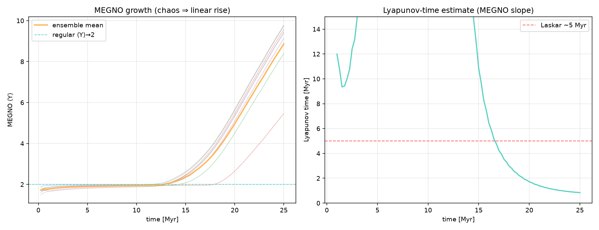

# Solar System Chaos: Numerical Investigation with REBOUND

An undergraduate research project investigating chaotic dynamics in the inner
Solar System using symplectic N-body integration. Developed under the Centre
of Excellence in Applied Mathematics (CEAM), PES University EC Campus.

**Status:** Work in progress. The simulation framework is complete and
validated, and a first chaos measurement, a preliminary reproduction of the
~5 Myr inner-Solar-System Lyapunov time, is included below. The planned
parameter-sweep experiments have not been run yet.

## Overview

The inner Solar System is known to be chaotic, with a Lyapunov time of about
5 Myr. The chaos is driven by overlapping secular resonances between the
terrestrial and giant planets, most prominently g₁ − g₅ (Laskar 1989;
Laskar 2008; Batygin & Laughlin 2008; Mogavero & Laskar 2022). This project
builds a configuration-driven numerical framework to reproduce this behaviour
and then probe it by changing outer-planet conditions (masses, orbital
elements, GR on/off) and measuring the response in inner-planet chaos
indicators.

The framework is built on REBOUND (Rein & Liu 2012) and REBOUNDx
(Tamayo et al. 2020). Every scientifically meaningful setting (bodies, masses,
orbital elements, GR, timestep, integrator) lives in configuration rather than
code, so each planned experiment is a one-line override.

## First result: inner-Solar-System Lyapunov time

`experiments/lyapunov_inner.py` integrates an ensemble of 8 full
Sun + 8-planet systems for 25 Myr with MEGNO enabled. Each system gets a
random 10⁻⁹ AU kick to Mercury's initial position and its own variational seed.



| Quantity (at 25 Myr) | Value |
|---|---|
| Ensemble MEGNO ⟨Y⟩ | 8.87 ± 1.35 (all 8 trajectories between 5.5 and 9.8) |
| ⟨Y⟩ leaves the regular value 2 | at ~13 Myr (> 4 by ~19 Myr) |
| **Lyapunov time, running estimate** (`sim.lyapunov()`, ensemble mean ± 1σ) | **4.79 ± 2.29 Myr** |
| Lyapunov time, late-time MEGNO-slope estimate | 0.84 Myr |
| Reference value | ~5 Myr (Laskar 1989; Mogavero, Hoang & Laskar 2023) |

All 8 trajectories show clear chaotic growth, and the running
Lyapunov-time estimate reaches 4.79 Myr, consistent with Laskar's ~5 Myr.
**This result is preliminary and not converged:**

- The running estimate averages over the whole integration, including the
  first ~13 Myr, when ⟨Y⟩ ≈ 2. It was still falling at the end of the run
  (36.9 Myr at 16 Myr, 15.0 Myr at 20 Myr, 4.79 Myr at 25 Myr).
- The second estimator, a linear fit to the second half of ⟨Y⟩(t), gives
  0.84 Myr. It is biased the other way, because the fit window sits on the
  steep onset of chaotic growth. The script's automatic verdict
  (`outputs/lyapunov_inner/verdict.txt`) is based on this estimator and so
  reports "outside 3–8 Myr". The right-hand panel of the figure shows this
  slope estimator.
- Converging either estimator needs about 10 Lyapunov times (≳ 50 Myr) and a
  larger ensemble.
- REBOUNDx forces are not propagated through REBOUND's variational equations
  (REBOUNDx issues a warning to this effect). The GR correction therefore
  affects the reference orbit but not the tangent-vector dynamics that MEGNO
  measures.

Run configuration: WHFast, dt = 4 d, `gr_potential` GR on the Sun, built-in
J2000 initial conditions, standard kernel with no symplectic corrector (the
framework selects this automatically for MEGNO runs). The run took ~2.8 h of
wall-clock time, with the 8 trajectories integrated in parallel threads. The full
log is in `outputs/lyapunov_inner.log`.

## Methods

- **Integrator:** WHFast (Wisdom & Holman 1991; Rein & Tamayo 2015) in Jacobi
  coordinates with `safe_mode = 0`, timestep 4 days. Runs without MEGNO use the
  11th-order symplectic corrector and the lazy modified kernel (WHCKL; Rein,
  Tamayo & Brown 2019). MEGNO runs automatically switch to the standard kernel
  with no corrector, because variational particles don't support the lazy kernel.
- **Initial conditions:** By default, an offline built-in table of J2000
  heliocentric ecliptic elements from Standish & Williams' *Keplerian Elements
  for Approximate Positions of the Major Planets* (1800–2050 AD set). Masses are
  DE405 reciprocal planetary masses, with Earth as the Earth–Moon barycentre.
  The framework uses these mean elements as osculating initial conditions. That
  is fine for chaos statistics but not for ephemeris-accurate work.
  Initial conditions for any epoch can optionally be pulled from NASA/JPL
  Horizons (`ceam-sim horizons`). None of the included results use Horizons data.
- **Additional physics:** General-relativistic correction via REBOUNDx
  `gr_potential` on the Sun (Nobili & Roxburgh 1986). Solar J₂ via
  REBOUNDx `gravitational_harmonics` is available but off by default.
- **Chaos diagnostics:** MEGNO (Cincotta & Simó 2000; Cincotta, Giordano &
  Simó 2003) and the Lyapunov characteristic number, computed with REBOUND's
  variational equations (Rein & Tamayo 2016) via `sim.init_megno()`,
  `sim.megno()` and `sim.lyapunov()`.
- **Other diagnostics:** Energy and angular-momentum conservation,
  angular-momentum deficit (AMD; Laskar 1997), orbital-element statistics, and
  FFT secular spectra of e·exp(iϖ) annotated with the Laskar et al. (2004)
  secular frequencies gᵢ.
- **Output:** REBOUND SimulationArchive (Rein & Tamayo 2017) for bit-reproducible
  restarts, plus NumPy time series, JSON/CSV statistics, figures and a Markdown
  report for every run.

## Validation

Measured from the committed 1 Myr run (`outputs/showcase_1Myr/`: Sun + 8
planets, GR, dt = 4 d, MEGNO on, so standard kernel with no corrector):

| Diagnostic | Measured | Expectation |
|---|---|---|
| Max energy error \|ΔE/E\| over 1 Myr | 9.1 × 10⁻¹⁰ | Bounded, well below the 10⁻⁷ tolerance |
| Max angular-momentum error \|ΔL/L\| over 1 Myr | 4.6 × 10⁻¹³ | Near machine precision (tolerance 10⁻¹⁰) |
| Mercury mean perihelion advance | 564″/century (1578° over 1 Myr) | g₁ ≈ 5.59″/yr = 559″/century (Laskar et al. 2004); present-day ≈ 575″/century (≈ 532″ planetary + 43″ GR) |
| AMD change over 1 Myr | × 1.05 | No secular growth |

The 100 kyr run in `outputs/confirm_100k/` gives the same picture
(|ΔE/E| = 8.8 × 10⁻¹⁰, |ΔL/L| = 2.0 × 10⁻¹³). As expected, MEGNO stays near 2
(regular) for both runs, because they are far shorter than the Lyapunov time.

## Installation

Requires Python ≥ 3.10 and a C compiler (REBOUND and REBOUNDx build from source
if no wheel is available).

```bash
python3 -m venv .venv
.venv/bin/python -m pip install --upgrade pip setuptools wheel
.venv/bin/python -m pip install -e .          # installs deps + the `ceam-sim` CLI
.venv/bin/python tests/test_smoke.py          # quick sanity checks
```

## Usage

```bash
# Default 1 Myr, 8-planet run with GR + MEGNO -> outputs/solar_default/
.venv/bin/ceam-sim

# Fast pipeline check (~20 kyr, low resolution)
.venv/bin/ceam-sim --quick --name smoke

# Reproduce the Lyapunov-time experiment (run from the repository root; ~3 h)
.venv/bin/python experiments/lyapunov_inner.py --t-max-myr 25 --name lyapunov_inner
```

From Python:

```python
from solarsystem import load_config, run_pipeline

cfg = load_config("config/default.yaml",
                  overrides=["time.t_end_years=2e6", "physics.gr.mode=none"])
out = run_pipeline(cfg)
print(out.summary["conservation"]["max_dE_rel"])
```

### Configuration

All parameters live in [`config/default.yaml`](config/default.yaml), which is
fully commented. You can override any value with `--set a.b.c=value` or with the
convenience flags `--t-end`, `--dt`, `--gr`, `--name`, `--no-megno`,
`--no-plots`, `--animate` and `--quick`. Config units are days, Julian years and
degrees. Internally the framework uses REBOUND's `('AU', 'yr2pi', 'Msun')`
system (G = 1).

To use JPL Horizons initial conditions for a specific epoch instead of the
built-in table:

```bash
.venv/bin/ceam-sim horizons --epoch "2025-01-01 00:00" --out cache/horizons_2025.yaml
.venv/bin/ceam-sim --set bodies.source=file --set bodies.file=cache/horizons_2025.yaml
```

### Outputs

Each run writes to `outputs/<run.name>/`:

```
config.resolved.yaml   exact resolved configuration
archive.bin            REBOUND SimulationArchive (git-ignored: large, regenerable)
timeseries.npz         energy, angular momentum, AMD, MEGNO, elements, positions
summary.json           conservation, chaos and per-planet statistics
statistics.csv         per-planet element statistics
report.md              human-readable report with embedded figures
figures/               orbits, conservation, e/i/a vs time, MEGNO, AMD,
                       secular spectrum, (h,k) phase portrait, dashboard
```

## Repository structure

```
solarsystem/             framework package
  constants.py           units, built-in J2000 body table, reference secular frequencies
  config.py              dataclass config model + YAML / dotted-override loader
  builder.py             builds rebound.Simulation (+ REBOUNDx GR/J2, MEGNO)
  horizons.py            optional JPL Horizons initial conditions
  diagnostics.py         energy / angular momentum / AMD / orbital elements
  runner.py              chunked symplectic integration + SimulationArchive
  analysis.py            statistics, conservation checks, secular spectra
  visualize.py           figures
  report.py              Markdown report generator
  pipeline.py            build → run → analyse → visualise → report
  cli.py                 `ceam-sim` command-line interface
config/default.yaml      default configuration
experiments/             standalone experiment scripts (lyapunov_inner.py)
outputs/                 committed results: showcase_1Myr, confirm_100k, lyapunov_inner
tests/test_smoke.py      fast sanity checks
```

## Planned next experiments

1. **Converged Lyapunov time:** extend the MEGNO ensemble to ≳ 50 Myr with
   more members, and cross-check with GR off.
2. **GR sensitivity study:** compare inner-planet MEGNO and eccentricity
   evolution with and without relativistic corrections (cf. Laskar 2008;
   Brown & Rein 2023).
3. **Jupiter mass scan:** vary M_Jupiter across [0.5, 2.0] M_Jup and measure
   the inner-planet MEGNO response, probing the g₁ − g₅ secular resonance.
4. **Outer-planet orbital elements:** scan the (e_Jupiter, e_Saturn) plane and
   run planet-removal cross-checks.
5. **Frozen vs. full outer-planet forcing:** compare inner-planet chaos under
   the fully self-consistent 8-planet integration with runs where the outer
   planets are held fixed (the framework has an experimental `freeze` option).

Each of these is a configuration override. For example:

```bash
.venv/bin/ceam-sim --gr none --t-end 5e6 --name gr_off
.venv/bin/ceam-sim --set bodies.overrides.Jupiter.mass_scale=1.5 --t-end 5e6 --name jupiter_x1.5
.venv/bin/ceam-sim --set bodies.overrides.Saturn.include=false --name no_saturn
```

## Team

- Manu Dhulipala
- Santosh Reddy
- Hari Yuvan

**Faculty Mentors:** Dr. Rahul S. and Dr. Manasa M., PES University EC Campus

## References

**Solar System chaos**

- Laskar, J. (1989). A numerical experiment on the chaotic behaviour of the
  Solar System. *Nature* 338, 237. doi:10.1038/338237a0
- Laskar, J. (1997). Large scale chaos and the spacing of the inner planets.
  *A&A* 317, L75.
- Laskar, J. (2008). Chaotic diffusion in the Solar System. *Icarus* 196, 1.
  doi:10.1016/j.icarus.2008.02.017
- Laskar, J., Robutel, P., Joutel, F., Gastineau, M., Correia, A. C. M. &
  Levrard, B. (2004). A long-term numerical solution for the insolation
  quantities of the Earth. *A&A* 428, 261. doi:10.1051/0004-6361:20041335
- Batygin, K. & Laughlin, G. (2008). On the dynamical stability of the Solar
  System. *ApJ* 683, 1207. doi:10.1086/589232
- Ito, T. & Tanikawa, K. (2002). Long-term integrations and stability of
  planetary orbits in our Solar system. *MNRAS* 336, 483.
  doi:10.1046/j.1365-8711.2002.05765.x
- Mogavero, F. & Laskar, J. (2022). The origin of chaos in the Solar System
  through computer algebra. *A&A* 662, L3. doi:10.1051/0004-6361/202243327
- Hoang, N. H., Mogavero, F. & Laskar, J. (2022). Long-term instability of the
  inner Solar System: numerical experiments. *MNRAS* 514, 1342.
  arXiv:2205.04170
- Mogavero, F., Hoang, N. H. & Laskar, J. (2023). Timescales of chaos in the
  inner Solar System: Lyapunov spectrum and quasi-integrals of motion.
  *Phys. Rev. X* 13, 021018. doi:10.1103/PhysRevX.13.021018
- Brown, G. & Rein, H. (2020). A repository of vanilla long term integrations
  of the Solar System. *RNAAS* 4, 221. arXiv:2012.05177
- Brown, G. & Rein, H. (2023). General relativistic precession and the
  long-term stability of the Solar System. *MNRAS* 521, 4349.
  arXiv:2303.05567
- Abbot, D. S., Webber, R. J., Hernandez, D. M., Hadden, S. & Weare, J.
  (2023). Mercury's chaotic secular evolution as a subdiffusive process.
  arXiv:2306.11870

**Numerical methods and software**

- Rein, H. & Liu, S.-F. (2012). REBOUND: an open-source multi-purpose N-body
  code for collisional dynamics. *A&A* 537, A128.
  doi:10.1051/0004-6361/201118085
- Tamayo, D., Rein, H., Shi, P. & Hernandez, D. M. (2020). REBOUNDx: a library
  for adding conservative and dissipative forces to otherwise symplectic
  N-body integrations. *MNRAS* 491, 2885. doi:10.1093/mnras/stz2870
- Wisdom, J. & Holman, M. (1991). Symplectic maps for the N-body problem.
  *AJ* 102, 1528. doi:10.1086/115978
- Rein, H. & Tamayo, D. (2015). WHFast: a fast and unbiased implementation of
  a symplectic Wisdom-Holman integrator for long-term gravitational
  simulations. *MNRAS* 452, 376. doi:10.1093/mnras/stv1257
- Rein, H. & Tamayo, D. (2016). Second-order variational equations for N-body
  simulations. *MNRAS* 459, 2275. doi:10.1093/mnras/stw644
- Rein, H. & Tamayo, D. (2017). A new paradigm for reproducing and analyzing
  N-body simulations of planetary systems. *MNRAS* 467, 2377.
  doi:10.1093/mnras/stx232
- Rein, H., Tamayo, D. & Brown, G. (2019). High-order symplectic integrators
  for planetary dynamics and their implementation in REBOUND. *MNRAS* 489,
  4632. doi:10.1093/mnras/stz2503
- Laskar, J. & Robutel, P. (2001). High order symplectic integrators for
  perturbed Hamiltonian systems. *Celest. Mech. Dyn. Astron.* 80, 39.
  doi:10.1023/A:1012098603882
- Cincotta, P. M. & Simó, C. (2000). Simple tools to study global dynamics in
  non-axisymmetric galactic potentials – I. *A&AS* 147, 205.
  doi:10.1051/aas:2000108
- Cincotta, P. M., Giordano, C. M. & Simó, C. (2003). Phase space structure of
  multi-dimensional systems by means of the mean exponential growth factor of
  nearby orbits. *Physica D* 182, 151. doi:10.1016/S0167-2789(03)00103-9
- Nobili, A. & Roxburgh, I. W. (1986). Simulation of general relativistic
  corrections in long term numerical integrations of planetary orbits.
  *IAU Symposium* 114, 105.

**Data**

- Standish, E. M. & Williams, J. G. Orbital ephemerides of the Sun, Moon, and
  planets. In *Explanatory Supplement to the Astronomical Almanac* (3rd ed.,
  Urban & Seidelmann, eds., 2013). Element table:
  <https://ssd.jpl.nasa.gov/planets/approx_pos.html>
- Standish, E. M. (1998). JPL Planetary and Lunar Ephemerides, DE405/LE405.
  JPL IOM 312.F-98-048.
- Giorgini, J. D. et al. (1996). JPL's On-Line Solar System Data Service.
  *BAAS* 28, 1158.

## License

Copyright (C) 2026 Manu Dhulipala, Santosh Reddy, Hari Yuvan

This program is free software: you can redistribute it and/or modify it under
the terms of the GNU General Public License as published by the Free Software
Foundation, either version 3 of the License, or (at your option) any later
version. See [`LICENSE`](LICENSE) for the full text.

## Acknowledgements

This project depends on the REBOUND N-body code and its REBOUNDx extension,
both GPL-3.0 licensed. Planetary elements and masses come from JPL
publications, with optional access to NASA/JPL Horizons. See
[`ATTRIBUTION.md`](ATTRIBUTION.md) for full attribution of software, data and
literature.
