# Simulation report — `confirm_100k`

*9 bodies · integrator `whfast` · dt = 4.0 d · GR `gr_potential` · J2 off*

Integrated to **1e+05 yr** (1501 samples). Status: **completed**.

## Conservation diagnostics

| quantity | max relative drift | tolerance | result |
|---|---|---|---|
| Energy $|\Delta E/E_0|$ | 8.77e-10 | 1e-07 | ✅ pass |
| Ang. momentum $|\Delta L/L_0|$ | 2.024e-13 | 1e-10 | ✅ pass |

Angular-momentum deficit (AMD): initial 5.611e-06, final 5.562e-06, max 5.9e-06 (growth ×1.05).

## Chaos indicators

- **MEGNO** ⟨Y⟩ (final): **1.828** → classified *regular* (⟨Y⟩→2 regular, ≳4 chaotic).
- Lyapunov time (running estimate): 3.961e+05 yr; (MEGNO-slope estimate): 9.639e+05 yr.
- ⚠️ *Run length (1e+05 yr) is short compared to the ~5e+06 yr inner-system Lyapunov time; MEGNO needs ≳ tens of Myr to firmly diagnose chaos. For a 1-Myr run, ⟨Y⟩≈2 is expected even though the system is formally chaotic.*

## Per-planet statistics

| planet | a₀ [AU] | e mean | e min | e max | e range | i mean [°] | i max [°] |
|---|---|---|---|---|---|---|---|
| Mercury | 0.387099 | 0.2037 | 0.196 | 0.2075 | 0.01158 | 6.27 | 7.005 |
| Venus | 0.723336 | 0.007452 | 0.002319 | 0.02083 | 0.01851 | 1.974 | 3.395 |
| Earth | 1 | 0.0106 | 0.002353 | 0.01671 | 0.01436 | 1.792 | 3.311 |
| Mars | 1.52371 | 0.09955 | 0.0861 | 0.1209 | 0.03476 | 2.629 | 4.437 |
| Jupiter | 5.20289 | 0.04606 | 0.02534 | 0.05954 | 0.0342 | 1.633 | 1.999 |
| Saturn | 9.53668 | 0.05049 | 0.009552 | 0.08709 | 0.07754 | 1.773 | 2.526 |
| Uranus | 19.1892 | 0.04237 | 0.02799 | 0.05584 | 0.02785 | 0.8031 | 1.321 |
| Neptune | 30.0699 | 0.009616 | 0.0007384 | 0.0185 | 0.01777 | 1.849 | 1.888 |

## Secular frequencies (FFT peaks)

FFT frequency resolution ≈ 13 ″/yr. Dominant perihelion-precession peak per planet vs. the Laskar reference $g_i$ (″/yr):

| planet | measured peak [″/yr] | nearest reference |
|---|---|---|
| Mercury | 12.95 | g3 = 17.368 |
| Venus | 12.95 | g3 = 17.368 |
| Earth | 12.95 | g3 = 17.368 |
| Mars | 12.95 | g3 = 17.368 |
| Jupiter | 25.9 | g6 = 28.245 |
| Saturn | 25.9 | g6 = 28.245 |
| Uranus | 12.95 | g3 = 17.368 |
| Neptune | 12.95 | g3 = 17.368 |

## Figures

### Orbital traces

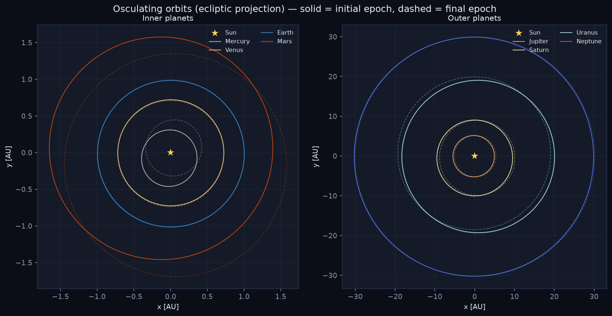

### Conservation

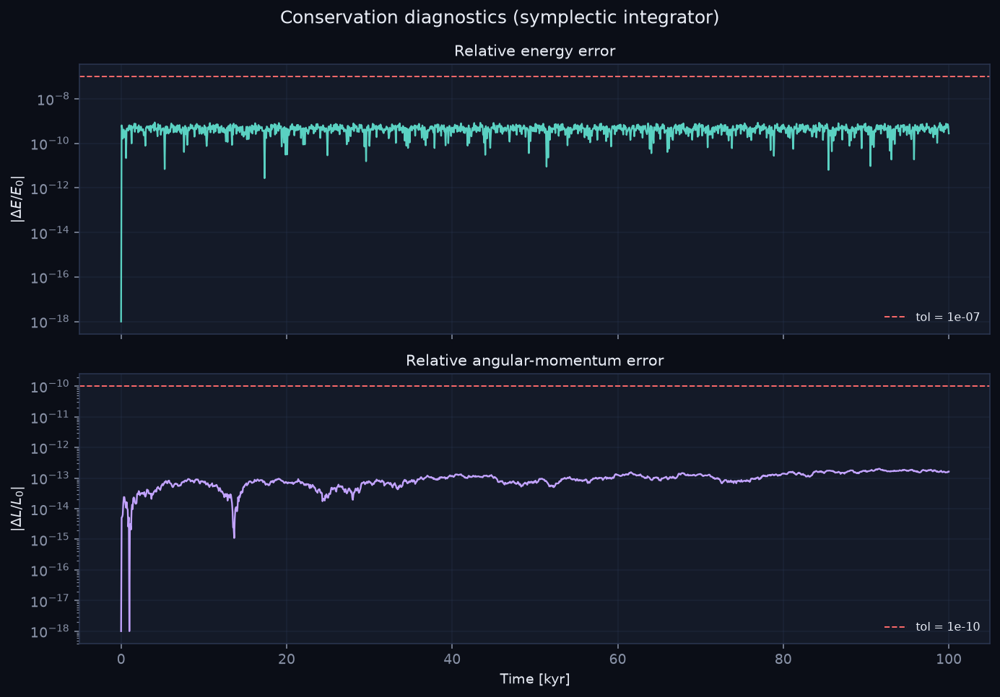

### Eccentricity

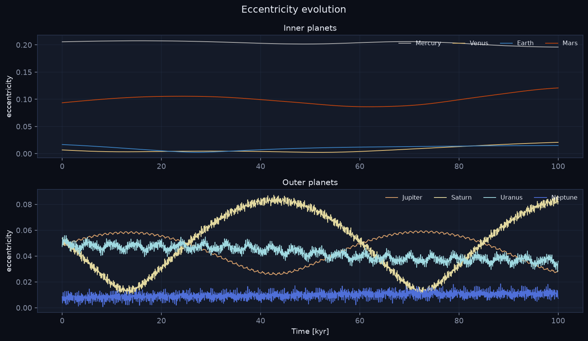

### Inclination

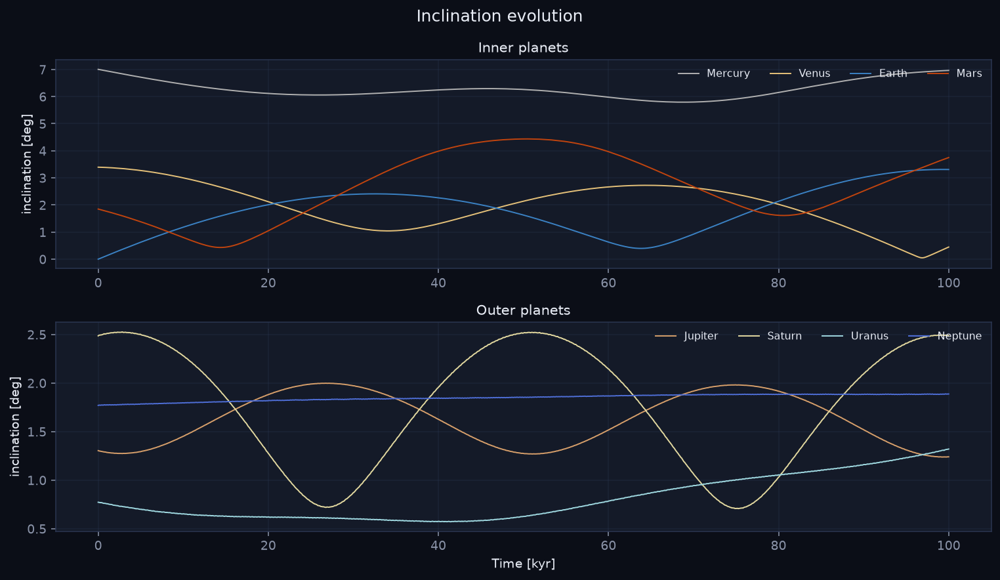

### Semi-major axis

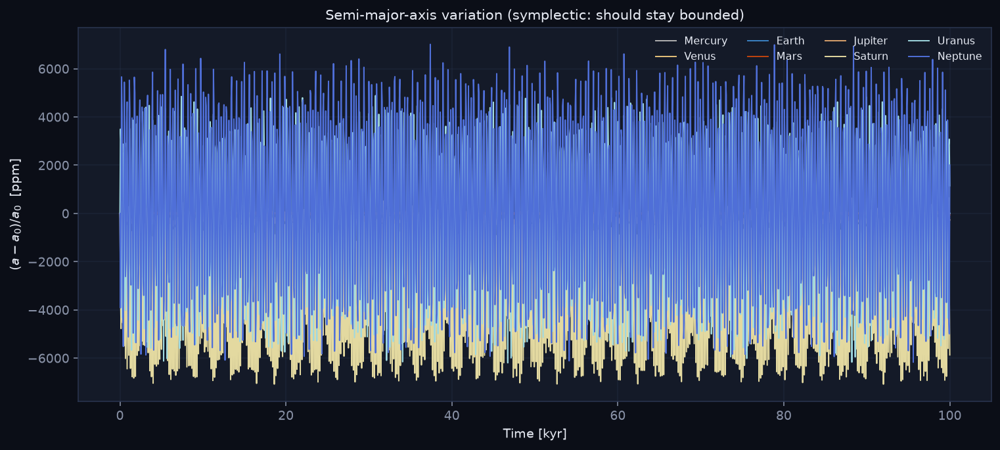

### Body panel

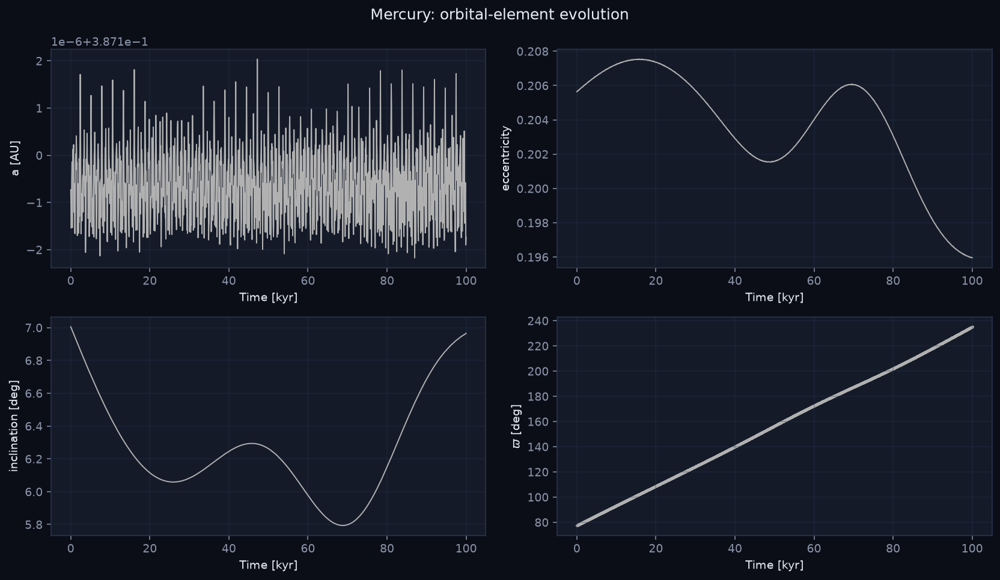

### AMD

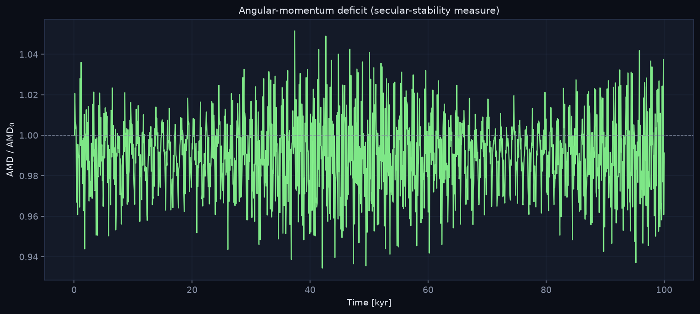

### h–k phase portrait

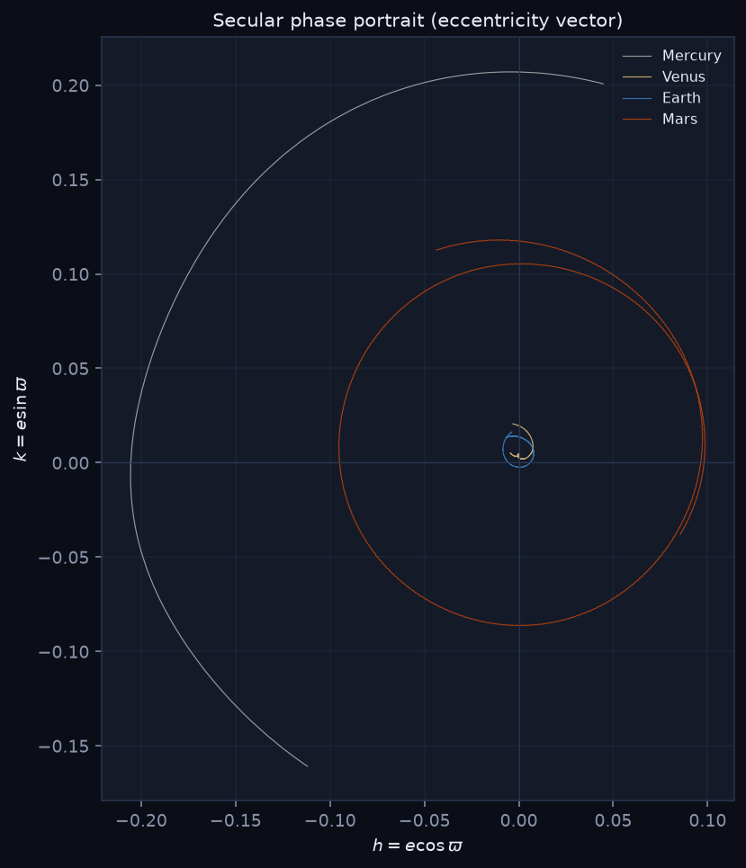

### MEGNO

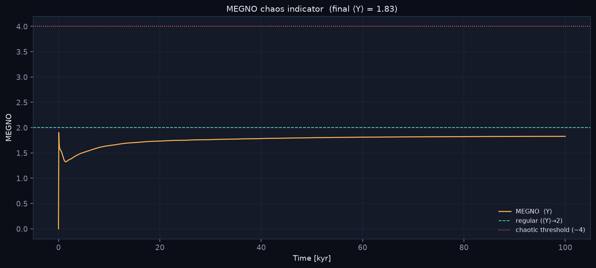

### Secular spectrum

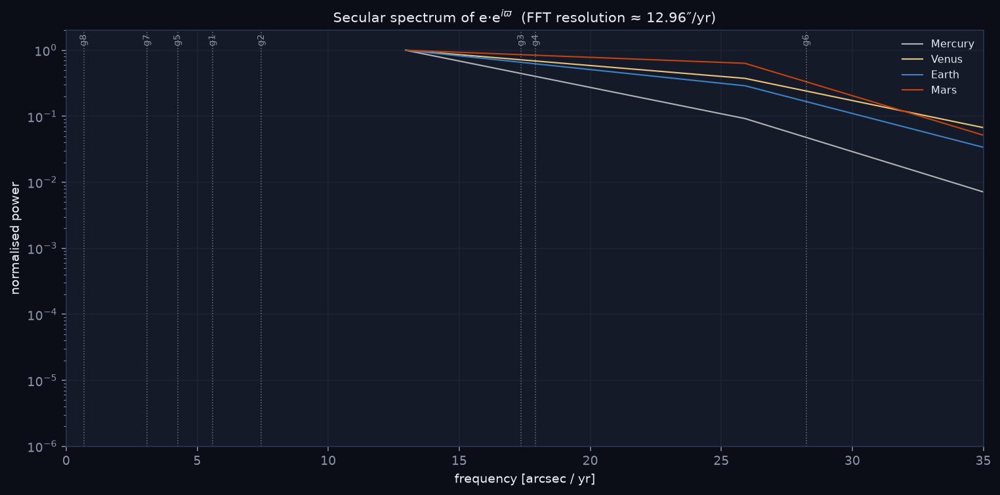

### Dashboard

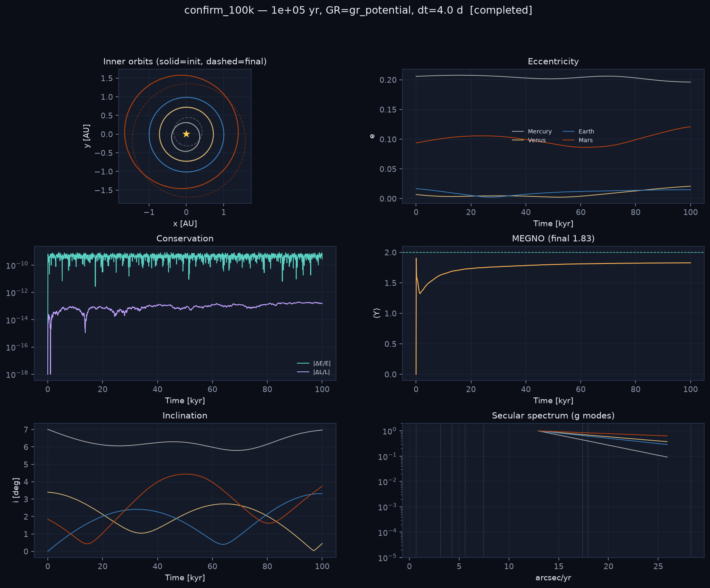

---
*Generated by the CEAM Solar-System chaos framework (REBOUND + REBOUNDx).*
