# Simulation report — `showcase_1Myr`

*9 bodies · integrator `whfast` · dt = 4.0 d · GR `gr_potential` · J2 off*

Integrated to **1e+06 yr** (2001 samples). Status: **completed**.

## Conservation diagnostics

| quantity | max relative drift | tolerance | result |
|---|---|---|---|
| Energy $|\Delta E/E_0|$ | 9.056e-10 | 1e-07 | ✅ pass |
| Ang. momentum $|\Delta L/L_0|$ | 4.556e-13 | 1e-10 | ✅ pass |

Angular-momentum deficit (AMD): initial 5.611e-06, final 5.503e-06, max 5.886e-06 (growth ×1.05).

## Chaos indicators

- **MEGNO** ⟨Y⟩ (final): **1.678** → classified *regular* (⟨Y⟩→2 regular, ≳4 chaotic).
- Lyapunov time (running estimate): ∞ yr; (MEGNO-slope estimate): — yr.
- ⚠️ *Run length (1e+06 yr) is short compared to the ~5e+06 yr inner-system Lyapunov time; MEGNO needs ≳ tens of Myr to firmly diagnose chaos. For a 1-Myr run, ⟨Y⟩≈2 is expected even though the system is formally chaotic.*

## Per-planet statistics

| planet | a₀ [AU] | e mean | e min | e max | e range | i mean [°] | i max [°] |
|---|---|---|---|---|---|---|---|
| Mercury | 0.387099 | 0.1837 | 0.1303 | 0.2412 | 0.1109 | 6.998 | 9.979 |
| Venus | 0.723336 | 0.02854 | 0.002336 | 0.06033 | 0.058 | 1.942 | 4.036 |
| Earth | 1 | 0.02471 | 0.001222 | 0.0533 | 0.05207 | 1.784 | 3.311 |
| Mars | 1.52371 | 0.07852 | 0.02896 | 0.1225 | 0.09349 | 5.094 | 7.717 |
| Jupiter | 5.20289 | 0.04387 | 0.0235 | 0.06033 | 0.03683 | 1.568 | 1.997 |
| Saturn | 9.53668 | 0.0539 | 0.008612 | 0.08813 | 0.07952 | 1.675 | 2.522 |
| Uranus | 19.1892 | 0.0433 | 0.001016 | 0.07693 | 0.07592 | 1.685 | 2.703 |
| Neptune | 30.0699 | 0.009766 | 0.0002785 | 0.02099 | 0.02071 | 2.052 | 2.371 |

## Secular frequencies (FFT peaks)

FFT frequency resolution ≈ 1.3 ″/yr. Dominant perihelion-precession peak per planet vs. the Laskar reference $g_i$ (″/yr):

| planet | measured peak [″/yr] | nearest reference |
|---|---|---|
| Mercury | 5.181 | g1 = 5.59 |
| Venus | 7.772 | g2 = 7.452 |
| Earth | 3.886 | g5 = 4.257 |
| Mars | 16.84 | g3 = 17.368 |
| Jupiter | 3.886 | g5 = 4.257 |
| Saturn | 25.91 | g6 = 28.245 |
| Uranus | 3.886 | g5 = 4.257 |
| Neptune | 1.295 | g8 = 0.673 |

## Figures

### Orbital traces

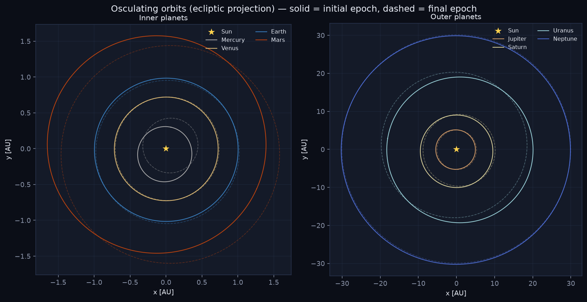

### Conservation

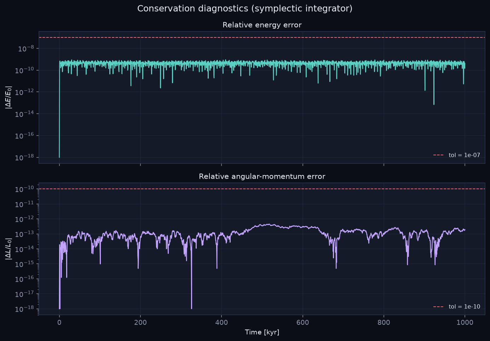

### Eccentricity

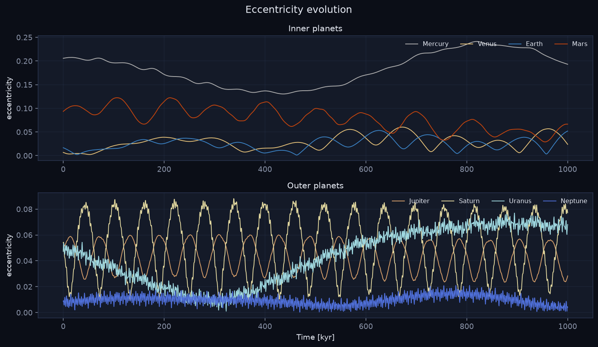

### Inclination

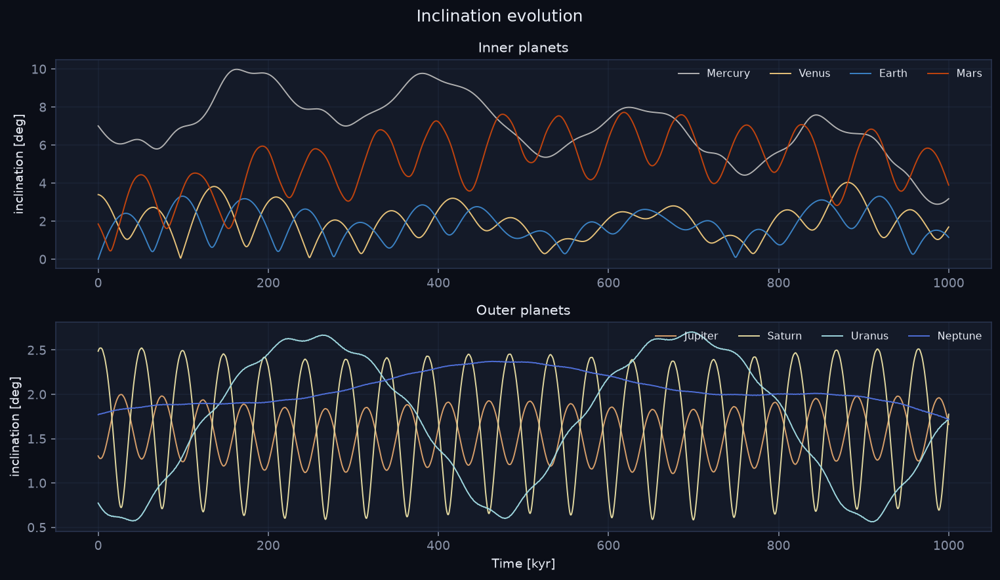

### Semi-major axis

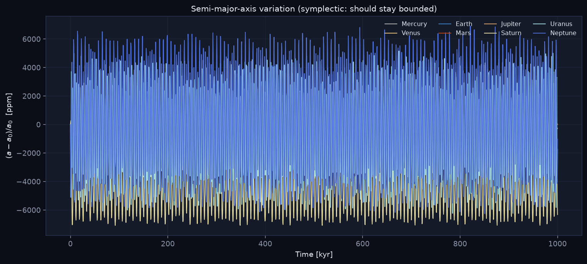

### Body panel

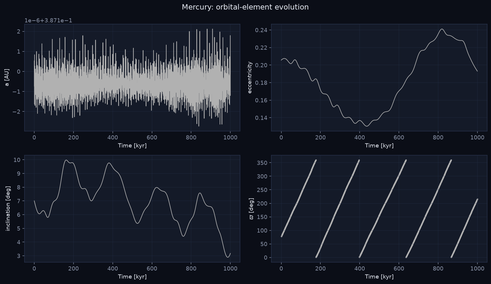

### AMD

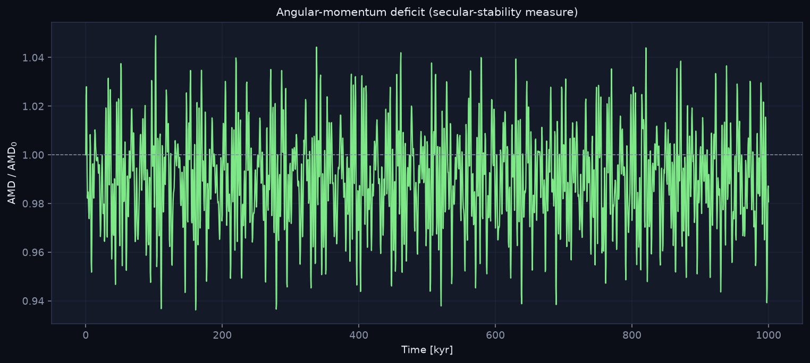

### h–k phase portrait

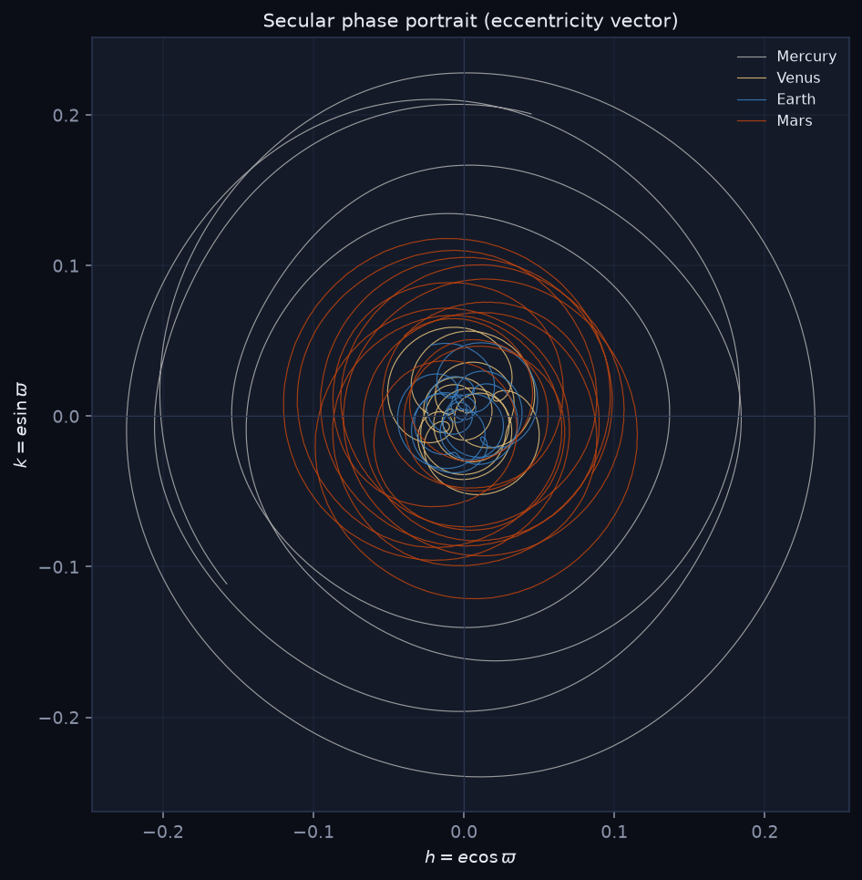

### MEGNO

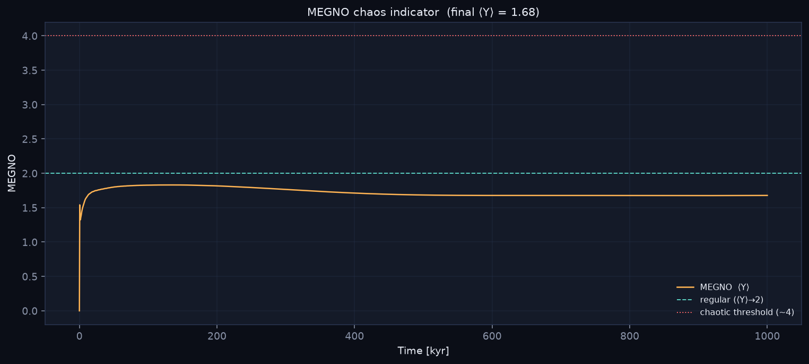

### Secular spectrum

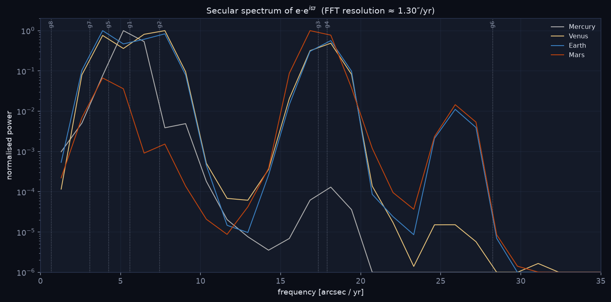

### Dashboard

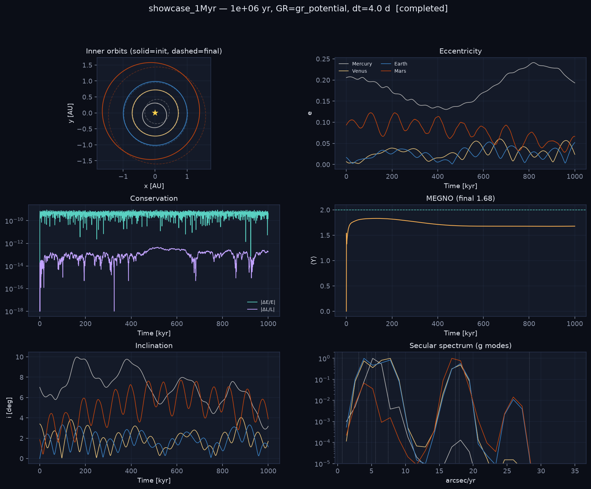

---
*Generated by the CEAM Solar-System chaos framework (REBOUND + REBOUNDx).*
